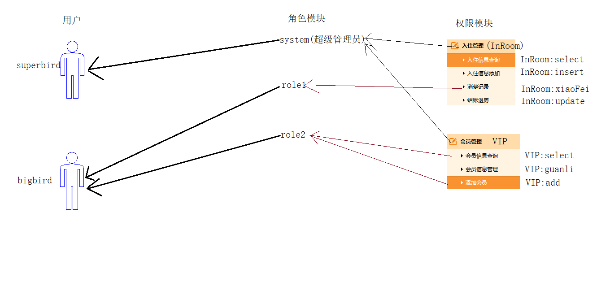
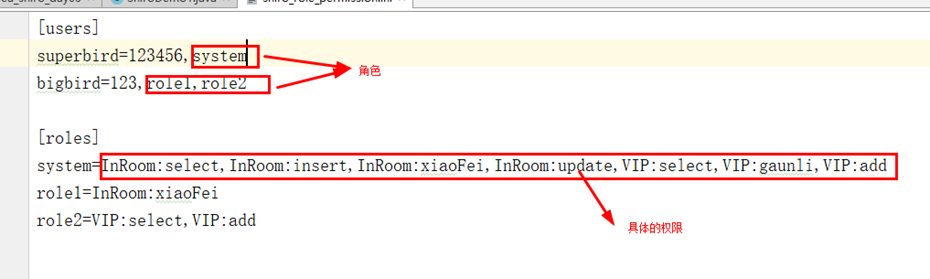
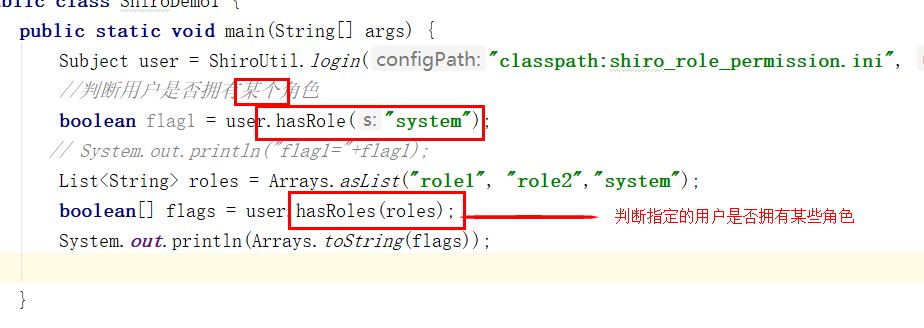
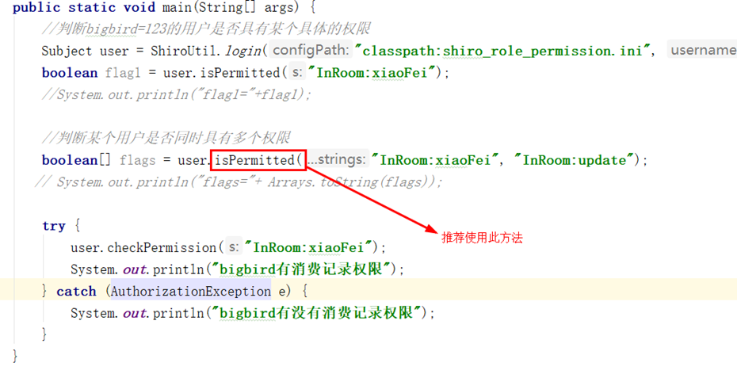

# 4 Shiro授权

## 4.1 用户、角色和权限三者之间的关系

1：用户

用户包含两个部分，账号(lisi)，密码。

2：权限

规定什么事情可以做，什么事情不能做。

3：角色

一组权限的集合。

 

## 4.2 Shiro授权的几种方式

1：编程式授权

判断用户拥有哪些角色，判断用户拥有哪些具体的权限

2：注解式授权

3：jsp标签授权

## 4.3 编程示例

### 4.3.1 编写pom.xml文件

	<?xml version="1.0" encoding="UTF-8"?>
	<project xmlns="http://maven.apache.org/POM/4.0.0"
	         xmlns:xsi="http://www.w3.org/2001/XMLSchema-instance"
	         xsi:schemaLocation="http://maven.apache.org/POM/4.0.0 http://maven.apache.org/xsd/maven-4.0.0.xsd">
	    <modelVersion>4.0.0</modelVersion>
	
	    <groupId>com.marshal.shiro</groupId>
	    <artifactId>shouquan</artifactId>
	    <version>1.0-SNAPSHOT</version>
	
	    <dependencies>
	        <dependency>
	            <groupId>org.apache.shiro</groupId>
	            <artifactId>shiro-core</artifactId>
	            <version>1.2.4</version>
	        </dependency>
	
	        <dependency>
	            <groupId>org.slf4j</groupId>
	            <artifactId>slf4j-log4j12</artifactId>
	            <version>1.7.12</version>
	        </dependency>
	
	        <dependency>
	            <groupId>com.alibaba</groupId>
	            <artifactId>druid</artifactId>
	            <version>1.1.10</version>
	        </dependency>
	
	        <dependency>
	            <groupId>commons-logging</groupId>
	            <artifactId>commons-logging</artifactId>
	            <version>1.2</version>
	        </dependency>
	
	        <dependency>
	            <groupId>mysql</groupId>
	            <artifactId>mysql-connector-java</artifactId>
	            <version>5.1.37</version>
	        </dependency>
	    </dependencies>
	
	</project>

### 4.3.2 编写Shiro配置文件shiro_role_permission.ini

	[users]
	superbird=123456,system
	bigbird=123,role1,role2
	
	[roles]
	system=InRoom:select,InRoom:insert,InRoom:xiaoFei,InRoom:update,VIP:select,VIP:gaunli,VIP:add
	role1=InRoom:xiaoFei
	role2=VIP:select,VIP:add

该配置文件中说明有两个用户“superbird”、“bigbird”。
有三个角色分别为“system”、“role1”、“role2”。
用户的权限被绑定在角色当中，角色绑定在了用户上。

 

### 4.3.3 在包com.marshal.shiro.utils下编写工具类ShiroUtil.java

	package com.marshal.shiro.utils;
	
	import org.apache.shiro.SecurityUtils;
	import org.apache.shiro.authc.AuthenticationException;
	import org.apache.shiro.authc.UsernamePasswordToken;
	import org.apache.shiro.config.IniSecurityManagerFactory;
	import org.apache.shiro.mgt.SecurityManager;
	import org.apache.shiro.subject.Subject;
	import org.apache.shiro.util.Factory;
	
	public class ShiroUtil {
	
	    /**
	     * 身份认证
	     * @param configPath
	     * @param username
	     * @param password
	     * @return
	     */
	    public static Subject login(String configPath,String username,String password) {
	        
	        //找资源：ctrl+shift+n
	        //核心类:SecurityManager
	        Factory<SecurityManager> factory = new IniSecurityManagerFactory(configPath);
	        SecurityManager securityManager = factory.getInstance();
	        
	        //当前用户Subject
	        SecurityUtils.setSecurityManager(securityManager);
	        Subject user = SecurityUtils.getSubject();
	        
	        //模拟用户输入用户名与密码
	        UsernamePasswordToken token = new UsernamePasswordToken(username,password);
	        try {
	            user.login(token);
	            System.out.println("登录成功");
	        } catch (AuthenticationException e) {
	            System.out.println("登录失败");
	        }
	        return user;
	    }
	}

工具类一般都会被放置在名为util的包中，而且方法一般均为静态方法。

### 4.3.4 测试执行代码

测试执行代码1

	package com.marshal.shiro.demo;
	
	import com.marshal.shiro.utils.ShiroUtil;
	import org.apache.shiro.subject.Subject;
	
	import java.util.Arrays;
	import java.util.List;
	
	public class ShiroDemo1 {
	    public static void main(String[] args) {
	
	        Subject user = ShiroUtil.login("classpath:shiro_role_permission.ini", "bigbird", "123");
	
	        //判断用户是否拥有某个角色
	        boolean flag1 = user.hasRole("system");
	
	        // System.out.println("flag1="+flag1);
	        List<String> roles = Arrays.asList("role1", "role2","system");
	        
	        boolean[] flags = user.hasRoles(roles);
	        System.out.println(Arrays.toString(flags));
	
	    }
	}

 

根据Shiro可以得到测试的直接结果为：

    [true, true, false]

测试执行代码2

	package com.marshal.shiro.demo;
	
	import com.marshal.shiro.utils.ShiroUtil;
	import org.apache.shiro.authz.AuthorizationException;
	import org.apache.shiro.subject.Subject;
	
	import java.util.Arrays;
	
	public class ShiroDemo2 {
	
	    public static void main(String[] args) {
	
	        //判断bigbird=123的用户是否具有某个具体的权限
	        Subject user = ShiroUtil.login("classpath:shiro_role_permission.ini", "bigbird", "123");
	        boolean flag1 = user.isPermitted("InRoom:xiaoFei");
	        //System.out.println("flag1="+flag1);
	
	        //判断某个用户是否同时具有多个权限
	        boolean[] flags = user.isPermitted("InRoom:xiaoFei", "InRoom:update");
	       // System.out.println("flags="+ Arrays.toString(flags));
	
	        try {
	            user.checkPermission("InRoom:xiaoFei");
	            System.out.println("bigbird有消费记录权限");
	        } catch (AuthorizationException e) {
	            System.out.println("bigbird有没有消费记录权限");
	        }
	    }
	}

 

根据Shiro可以得到测试的直接结果为：

    bigbird有消费记录权限